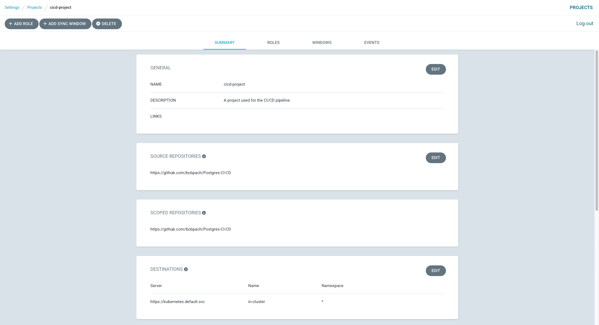
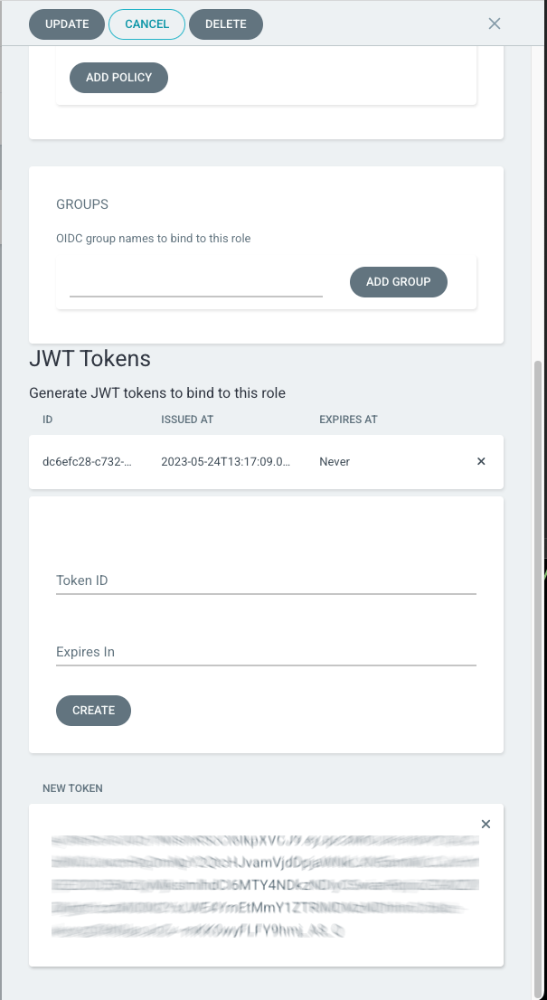

# CI/CD with Crunchy Postgres for Kubernetes and Argo Part -1
# DRAFT

Continuous Integration / Continuous Delivery (CI/CD) is an automated approach in which incremental code changes are made, built, tested and delivered.  GitOps plays an important part in enabling CI/CD.  If you are unfamiliar with Gitops and haven't seen [my blog](https://www.crunchydata.com/blog/postgres-gitops-with-argo-and-kubernetes) you may want to look at that before you proceed here.  In this blog we will build upon what learned in the GitOps blog.

Using Crunchy Postgres for Kubernetes, ArgoCD and the Crunchy Postgres Self Test container, we will deploy a postgres cluster to a developer namespace, run a series of tests on the deployed cluster and once the tests pass we will automatically deploy the same postgres cluster to a QA namespace.

## Requirements
 - The Crunchy Data Postgres Operator (PGO) v5.2 or later deployed in the kubernetes cluster.  
 - PGO must have the sidecar functionality enabled.  To enable the sidecar functionality you will need to add the following to the `Deployment.spec.template.spec.containers.env` section of the `manager.yaml` file located in the `postgres-operator-examples/kustomize/install/manager` directory.

```yaml
- name: PGO_FEATURE_GATES
  value: 'InstanceSidecars=true'
```
 - ArgoCD v 2.6 or later deployed in the kubernetes cluster.
 - A git repository containing the Crunchy Postgres for Kubernetes manifest to be deployed.  Here's a sample manifest you can use or you can fork [my git repository](https://github.com/bobpach/Postgres-CI-CD).

<details><summary>- kustomization.yaml</summary>

```yaml
resources:
- argocd-token.yaml
- hippo-self-test-config.yaml
- postgres.yaml
```
</details>

<details><summary>- postgres.yaml</summary>

```yaml
apiVersion: postgres-operator.crunchydata.com/v1beta1
kind: PostgresCluster
metadata:
  name: hippo
spec:
  image: bobpachcrunchy/crunchy-postgres:ubi8-13.8-5.2.0-0
  imagePullSecrets:
  - name: privatereg
  postgresVersion: 15
  shutdown: false
  users:
    - name: hippo
      options: "SUPERUSER"
  instances:
    - name: pgha1
      replicas: 3
      containers:
        - name: selftest
          image: bobpachcrunchy/postgres-self-test:1.0.0
          imagePullPolicy: IfNotPresent
          env:
            - name: ARGOCD_APP_NAME
              valueFrom:
                configMapKeyRef:
                  name: postgres-self-test-config
                  key: auto-promote-argocd-app-name
            - name: ARGOCD_NAMESPACE
              valueFrom:
                configMapKeyRef:
                  name: postgres-self-test-config
                  key: argocd-namespace
            - name: AUTO_PROMOTE
              valueFrom:
                configMapKeyRef:
                  name: postgres-self-test-config
                  key: auto-promote
            - name: ARGOCD_SERVICE_ADDRESS
              valueFrom:
                configMapKeyRef:
                  name: postgres-self-test-config
                  key: argocd-service-address
            - name: ARGOCD_TOKEN
              valueFrom:
                secretKeyRef:
                  key: token
                  name: argocd-token
            - name: ARGOCD_VERIFY_TLS
              valueFrom:
                configMapKeyRef:
                  name: postgres-self-test-config
                  key: argocd-verify-tls
            - name: DB_USER
              valueFrom:
                configMapKeyRef:
                  name: postgres-self-test-config
                  key: db-user
            - name: DB_USER_PASSWORD
              valueFrom:
                secretKeyRef:
                  key: password
                  name: hippo-pguser-hippo
            - name: CLUSTER_NAME
              valueFrom:
                configMapKeyRef:
                  name: postgres-self-test-config
                  key: cluster-name
            - name: LOG_LEVEL
              valueFrom:
                configMapKeyRef:
                  name: postgres-self-test-config
                  key: log-level
            - name: LOG_PATH
              valueFrom:
                configMapKeyRef:
                  name: postgres-self-test-config
                  key: log-path
            - name: NAMESPACE
              valueFrom:
                fieldRef:
                  apiVersion: v1
                  fieldPath: metadata.namespace
            - name: POSTGRES_CONN_ATTEMPTS
              valueFrom:
                configMapKeyRef:
                  name: postgres-self-test-config
                  key: postgres-conn-attempts
            - name: POSTGRES_CONN_INTERVAL
              valueFrom:
                configMapKeyRef:
                  name: postgres-self-test-config
                  key: postgres-conn-interval
            - name: SERVICE_PORT
              valueFrom:
                configMapKeyRef:
                  name: postgres-self-test-config
                  key: service-port
            - name: SSLMODE
              valueFrom:
                configMapKeyRef:
                  name: postgres-self-test-config
                  key: sslmode
          volumeMounts:
          - name: postgres-data
            readOnly: false
            mountPath: /pgdata
      dataVolumeClaimSpec:
        accessModes:
        - "ReadWriteOnce"
        resources:
          requests:
            storage: 1Gi
      affinity:
        podAntiAffinity:
          preferredDuringSchedulingIgnoredDuringExecution:
          - weight: 1
            podAffinityTerm:
              topologyKey: kubernetes.io/hostname
              labelSelector:
                matchLabels:
                  postgres-operator.crunchydata.com/cluster: hippo
                  postgres-operator.crunchydata.com/instance-set: pgha1         
  backups:
    pgbackrest:
      image: bobpachcrunchy/crunchy-pgbackrest:ubi8-5.2.0-0
      repos:
      - name: repo1
        volume:
          volumeClaimSpec:
            accessModes:
            - "ReadWriteOnce"
            resources:
              requests:
                storage: 1Gi
```
</details>
</br>

**Note:** For this blog the postgres cluster name is "hippo".  You should subtitute this name and any other relevant values with your proper information.

## Self Test Container
The Crunchy Postgres Self Test container will be deployed as a sidecar in each Postgres pod.  It runs read, write and delete tests in the cluster and confirms that replication is working as expected across all postgres pods.  If the tests pass it will synch an argocd application resulting in the promotion of the postgres cluster to another namespace.  The sidecar uses a config map to to manage self test behavior and ArgoCD application sync.  More information about the self test container and its configuration can be found [in github](https://github.com/bobpach/Crunchy-Postgres-Self-Test).

<details><summary>- postgres-self-test-config.yaml</summary>

```yaml
apiVersion: v1
data:  
  argocd-namespace: argocd
  argocd-service-address: <ip address of the argocd service>
  argocd-verify-tls: "false"
  auto-promote: "true"
  auto-promote-argocd-app-name: postgres-qa
  db-user: hippo
  cluster-name: hippo
  log-level: info 
  log-path: /pgdata
  postgres-conn-attempts: "12"
  postgres-conn-interval: "5"
  service-port: "5432"
  sslmode: require
kind: ConfigMap
metadata:
  labels:
    vendor: crunchydata
    postgres-operator.crunchydata.com/cluster: hippo
  name: postgres-self-test-config
```
</details>
## ArgoCD

You will need an ArgoCD token to connect to the server to synch the target application after the test passes.  To get an ArgoCD token you will need to create a repository, project, role and policy. This can be done through the UI or CLI.  For this blog we will use the UI.  See ArgoCD documentation for CLI installation and commands.

### Create an Argocd Repository
To add your git repository to Argo CD click on ‘Settings’ in the
navigation bar on the left.

Click on ‘Repositories’ and the ‘Connect Repo’ buttons. Provide the
necessary information and click ‘Save’. You should now have a connected repo. If
not, please review your settings and try again.

### Create an ArgoCD Project
Create an ArgoCD Project with the following properties:
- Project Name: ci-cd-project
- Description: A project used for the CI/CD pipeline.
- Source Repositories: < the git repository you registered with argocd >
- Destinations: 
  - Server: https://kubernetes.default.svc
  - Name: in-cluster
  - Namespace: *


<!--  -->

Click on the Roles tab and click the Add Role button.  Create a role and policy with the following properties:
- Role Name: ci-cd-sync
- Description: Project role used to synch apps from the CI/CD pipeline.
- Action: sync
- Application: cicd-project/*
- Permission: allow

Click the Create button.

<!--  -->
Click on the role name you just created and then click the Create button in the JWT Tokens section of the sidebar.  Click OK when prompted.
Copy and save the New Token in a safe place.

<!--  -->
Click the Update button.
Base 64 encode the New Token.
``` bash
echo < your new token > | base64
```
Copy the output in put it in the argocd-token.yaml file

<details><summary>- argocd-token.yaml</summary>

```yaml
apiVersion: v1
data:
  token: <your base64 encoded argocd token>
kind: Secret
metadata:
  name: argocd-token
type: Opaque
```
</details>

### Create the ArgoCD Applications
We will create two Argocd applications.  Create the first one with the following properties:
- General
  - Application Name: postgres-dev
  - Project Name: ci-cd project
- Source
  - Repository URL: < the git repository you registered with argocd >
  - Path: <the path to the kustomization file in the gut repo >
- Destination:
  - Cluster URL: https://kubernetes.default.svc
  - Namespace: postgres-dev

Click the create button.

Create the second application with the same properties as the first one with two exceptions:
- General
  - Application Name: **postgres-qa**
- Destination:
  - Namespace: **postgres-qa**

Click the create button.

<!--  -->