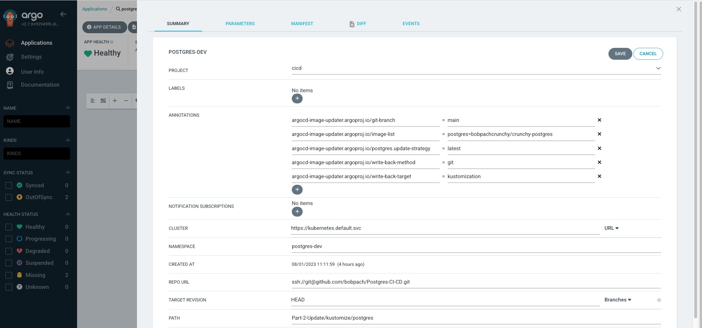

# Use CI/CD to Automatically Update Postgres Images with Argo CD
# DRAFT
This is the part 2 of CI/CD with Crunchy Postgres for Kubernetes and Argo.  We will pickup from where we left off in [part 1](https://github.com/bobpach/Postgres-CI-CD/tree/main/Part-1-Deployment). In this blog, we will use ArgoCD Image Updater to monitor a private Docker registry for changes to the postgres image tag.  The image updater will update the image tags in github and the ArgoCD application will deploy those changes to the postgres-dev namespace.  Once deployed, the [self-test](https://github.com/bobpach/Crunchy-Postgres-Self-Test) will run and the changes will be applied to the postgres-qa namespace if all tests pass.

## Prerequisites
There are a few pre-requisites you will need to handle if you plan on following along with this example :
- A fully functional ArgoCD deployment and a Crunchy Data Postgres cluster as described in my previous [CI/CD blog](https://www.crunchydata.com/blog/ci-cd-with-crunchy-postgres-for-kubernetes-and-argo).
- A private container registry containing the images you want to deploy. Most
  organizations will pull images, tag them and then upload them into their
  private registries. For this blog I am using a private registry for all images
  except the self test. That image is in a public repo in my docker registry.
- An [access token](https://docs.github.com/en/authentication/connecting-to-github-with-ssh/managing-deploy-keys) for your private registry.
- A git repository containing the Crunchy Postgres for Kubernetes manifest to be
  deployed. Here's a sample manifest you can use or you can fork
  [my git repository](https://github.com/bobpach/Postgres-CI-CD).
- A [deploy key](https://docs.github.com/en/authentication/connecting-to-github-with-ssh/managing-deploy-keys) with write access to your git repo.

## Secrets
We will need to create some secrets for the registry access token and git deploy key in the argocd namespace.  Sample files are provided in my [git repository](https://github.com/bobpach/Postgres-CI-CD/tree/main/Part-2-Update).  You will need to provide relevant values in the provided sample files and apply them to the argocd namespace.

```bash
kubectl apply -n argocd -f secrets/privaterepo.yaml
kubectl apply -n argocd -f secrets/privatereg.yaml
```

You should already have a secret called argocd-token in the postgres-dev and postgres-qa namespaces.  This secret contains the base64 encoded JWT token that was created in the sync role in the cicd project in ArgoCD.  It was created as part of the initial CI/CD blog. 

## Argo CD Image Updater
[Argo CD Image Updater](https://argocd-image-updater.readthedocs.io/en/stable/) is a tool to automatically update the container images of Kubernetes workloads that are managed by Argo CD.  We will use it to monitor postgres container images in our private docker registry.

### Installation
We will install Argo CD Image Updater into the argocd namespace in our kubernetes cluster.  We already have Argo CD installed there from the previous blog.

``` bash
kubectl apply -n argocd -f https://raw.githubusercontent.com/argoproj-labs/argocd-image-updater/stable/manifests/install.yaml
```

You should now see it in your pod list:

```bash
kubectl -n argocd get po
NAME                                                READY   STATUS    RESTARTS      AGE
argocd-application-controller-0                     1/1     Running   0             80m
argocd-applicationset-controller-685679ccb9-x9962   1/1     Running   0             80m
argocd-dex-server-8f9dbcfb6-zrhgp                   1/1     Running   0             80m
argocd-image-updater-56d94c674d-8ddpf               1/1     Running   0             38s
argocd-notifications-controller-5d65949b4b-spp8p    1/1     Running   0             80m
argocd-redis-77bf5b886-67s9t                        1/1     Running   0             80m
argocd-repo-server-5b889d7495-r9clr                 1/1     Running   0             80m
argocd-server-785bc6f697-pb6cn                      1/1     Running   0             80m
```

We need to inform the argocd-image-updater container about the location of the private registry that it will be monitoring for updates.  We can do this by adding the following to the data property in the argocd-image-updater-config configmap in the argocd namespace:

```yaml
data:
  registries.conf: |
    registries:
    - name: Docker Hub
      prefix: docker.io
      api_url: https://registry-1.docker.io
      credentials: pullsecret:argocd/privatereg
      defaultns: library
      default: true
```
## Argo CD Applications
In the previous CI/CD blog we created two applications:
- postgres-dev
- postgres-qa
### Annotations
We want Argo CD Image Updater to update our kustomization file in git with new image tags for images that it finds in our private repo.  In order to do that we will have to add annotations in the postgres-dev application.

In the ARGO CD UI click on applications in the left pane.  Click on the postgres-dev application. Click on APP Details in the top bar.  Click edit in the top right of the application pane.  Click the + button to add a new annotation.  Enter the key and value.  Do this for each annotation as listed below.

- argocd-image-updater.argoproj.io/image-list: postgres=<your_registry_name>/<your_image_name>
  - e.g: argocd-image-updater.argoproj.io/image-list: postgres=bobpachcrunchy/crunchy-postgres 
- argocd-image-updater.argoproj.io/postgres.update-strategy: latest
- argocd-image-updater.argoproj.io/write-back-method: git
- argocd-image-updater.argoproj.io/git-branch: main
- argocd-image-updater.argoproj.io/write-back-target: kustomization



Click Save.

## Kustomize
In order for ArgoCD Image Updater to update our images in git we need to change how we reference our image tags.  In the previous CI/CD blog we referenced them in in the PostgresCluster custom resource itself.  Now we will move the postgres image tag into the kustomization.yaml file.  We will add a transformer and remove the tag from the custom resource.
### Transformer
postgres-cluster-image-transformer.yaml
```yaml
images:
- path: spec/image
  kind: PostgresCluster
```
### Kustomization.yaml
kustomization.yaml
#### Before
```yaml
resources:
- postgres-self-test-config.yaml
- postgres.yaml
```
#### After
```yaml
configurations:
- postgres-cluster-image-transformer.yaml
images:
- name: bobpachcrunchy/crunchy-postgres
  newTag: ubi8-15.1-5.3.0-1
resources:
- postgres-self-test-config.yaml
- postgres.yaml
```
### Postgres Cluster
postgres.yaml
#### Before
```yaml
spec:
  image: bobpachcrunchy/crunchy-postgres:ubi8-15.1-5.3.0-1
```
#### After
```yaml
spec:
  image: bobpachcrunchy/crunchy-postgres
```
Check these changes into your git repo.  They will be required before updating the postgres image in the registry.

